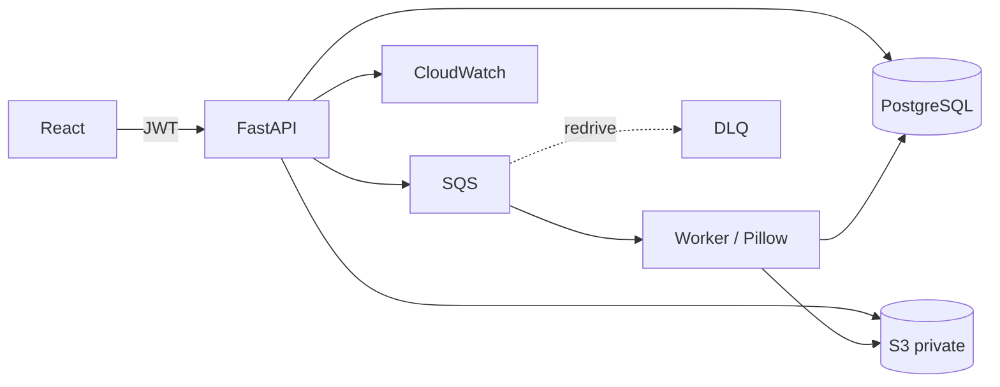

# CloudFlow

CloudFlow accepts image jobs, stores originals in private S3, and processes asynchronously with SQS and a Python worker.

## Architecture


Create `.env` from `.env.example`, fill the bucket/queue URL and a long random JWT secret. Configure AWS CLI profile `default` in `ap-south-1`. Start with `docker compose up --build`; open http://localhost:8080. Each uploaded image becomes a separate PostgreSQL job and SQS message. S3 holds image bytes, PostgreSQL holds metadata and state. API returns before processing; worker updates job and writes stable output keys. SQS is at-least-once, and the worker checks completed jobs before acknowledging duplicates.

Commands (PowerShell): stop with `docker compose down`; remove local database contents with `docker compose down -v`; backend tests `docker compose run --rm api pytest`; worker tests `docker compose run --rm worker pytest`; frontend build `cd frontend; npm ci; npm run build`.

Supported formats: JPEG, PNG, WebP, up to 10 MiB per file. Operations: resize, compress, JPEG→PNG, PNG→JPEG, grayscale. Users can only access their own jobs; downloads use five-minute presigned URLs. See [architecture](docs/architecture.md), [deployment](docs/deployment.md), [IAM](docs/iam-policy.json).

S3 must remain private with Block Public Access enabled. On EC2 use an IAM instance role. The prototype runs PostgreSQL and worker on a single host, so it is not highly available. Stop/terminate EC2 and delete test resources when idle; check AWS pricing before use. GitHub username: `manishkrmahato`; create the repository yourself and add its remote after `git init`.


## Push to GitHub

After creating an empty repository under `manishkrmahato`, run from `D:\CloudFlow`:

```powershell
git init
git add .
git commit -m "Build CloudFlow image processing platform"
git branch -M main
git remote add origin https://github.com/manishkrmahato/<repository>.git
git push -u origin main
```

Replace `<repository>` with the repository name you created. The ignore rules keep environment values, PEM keys, dependency folders, build output, and the preserved prior project tree out of the commit.
