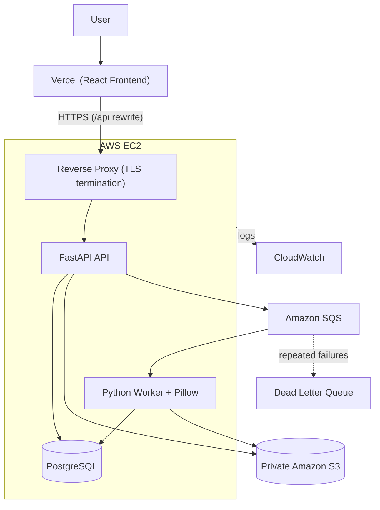

# CloudFlow

## Live Demo

**Production:** https://cloud-flow-virid.vercel.app/

> CloudFlow is deployed with the React frontend on Vercel and the backend services running on AWS EC2.

CloudFlow is an asynchronous image processing platform built with React, TypeScript, FastAPI, PostgreSQL, Amazon S3, Amazon SQS, Docker, and a Python background worker.

Authenticated users can upload one or multiple images, select an image processing operation, track processing jobs, retry failed jobs, and download completed results.

Instead of processing images inside an HTTP request, CloudFlow queues jobs in Amazon SQS. A dedicated Python worker consumes the queue, processes images with Pillow, stores the results in Amazon S3, and updates the corresponding job in PostgreSQL.

The project demonstrates practical concepts in full-stack development, asynchronous processing, distributed systems, cloud architecture, authentication, authorization, object storage, message queues, reliability, testing, Docker, CI/CD, and AWS deployment.

---

## Table of Contents

- [Features](#features)
- [Supported Image Operations](#supported-image-operations)
- [Architecture](#architecture)
- [Technology Stack](#technology-stack)
- [How CloudFlow Works](#how-cloudflow-works)
- [Job Lifecycle](#job-lifecycle)
- [Reliability and Failure Handling](#reliability-and-failure-handling)
- [Security](#security)
- [AWS Architecture](#aws-architecture)
- [Production Deployment](#production-deployment)
- [Project Structure](#project-structure)
- [Prerequisites](#prerequisites)
- [Environment Variables](#environment-variables)
- [Local Development](#local-development)
- [Docker](#docker)
- [Testing](#testing)
- [GitHub Actions](#github-actions)
- [AWS Setup](#aws-setup)
- [EC2 Deployment](#ec2-deployment)
- [API Overview](#api-overview)
- [Database Design](#database-design)
- [Architecture Decisions](#architecture-decisions)
- [Known Limitations](#known-limitations)
- [Future Improvements](#future-improvements)
- [Troubleshooting](#troubleshooting)
- [AWS Cost Considerations](#aws-cost-considerations)
- [Engineering Concepts Demonstrated](#engineering-concepts-demonstrated)
- [Documentation](#documentation)
- [Project Scope](#project-scope)
- [Author](#author)

---

## Features

### Authentication

- User registration and login
- JWT-based authentication
- Protected API endpoints
- Bearer token validation

### Authorization

- User-specific job access
- Job ownership validation
- Users can access only their own jobs and processing results

### Image Upload

- Upload one or multiple images
- Separate processing job for every uploaded image
- File type and file size validation
- Secure storage in Amazon S3

### Image Processing

- Resize images
- Compress images
- Convert JPEG to PNG
- Convert PNG to JPEG
- Convert images to grayscale

### Job Management

- Create and view image processing jobs
- Track job status and poll for completion
- Retry failed jobs
- Download completed images

### Asynchronous Processing

- Amazon SQS based job queue
- Dedicated Python background worker
- Non-blocking API requests
- At-least-once message processing
- Worker retry behavior
- Dead Letter Queue support

### Cloud Storage

- Private Amazon S3 bucket
- Original and processed image storage
- Server-side encryption
- Presigned download URLs
- S3 Block Public Access

### Reliability

- Worker idempotency checks
- Deterministic output object keys
- SQS visibility timeout
- Failed job states and retry handling
- Dead Letter Queue
- Persistent job state in PostgreSQL

### Frontend

- React and TypeScript
- Login and registration
- Image upload interface and operation selection
- Job dashboard with status tracking
- Retry and download functionality
- Responsive interface
- Accessible interactive elements

### DevOps

- Docker and Docker Compose
- GitHub Actions CI
- Frontend deployment on Vercel
- HTTPS-enabled backend on AWS EC2
- AWS IAM instance role
- CloudWatch logging

---

## Supported Image Operations

| Operation | Description |
|---|---|
| Resize | Changes the dimensions of an image |
| Compress | Reduces image file size |
| JPEG to PNG | Converts JPEG images to PNG |
| PNG to JPEG | Converts PNG images to JPEG |
| Grayscale | Converts an image to grayscale |

**Supported input formats:** JPEG, PNG, WebP

**Maximum file size:** 10 MiB per image

Each uploaded image creates an independent processing job. For example, uploading three images creates three separate PostgreSQL jobs and three separate SQS messages.

---

## Architecture



---

## Technology Stack

| Layer | Technologies |
|---|---|
| Frontend | React, TypeScript, Vite, CSS, Browser Fetch API |
| Backend | Python, FastAPI, Pydantic, SQLAlchemy, Alembic, JWT authentication, Boto3 |
| Worker | Python, Pillow, Boto3, Amazon SQS |
| Database | PostgreSQL 16 |
| AWS | Amazon EC2, Amazon S3, Amazon SQS, SQS Dead Letter Queue, AWS IAM, Amazon CloudWatch |
| Hosting | Vercel (frontend), Amazon EC2 (backend services) |
| DevOps | Docker, Docker Compose, Git, GitHub, GitHub Actions |
| Testing | Pytest, frontend build validation, frontend type validation |

---

## How CloudFlow Works

### 1. User Authentication

The user registers or logs in through the React frontend. The FastAPI backend validates the credentials and returns a JWT. Protected requests include the token in the `Authorization` header.

```text
React Frontend
      |
      | Login
      v
FastAPI Backend
      |
      | Validate credentials
      v
JWT Token
```

### 2. Image Upload

The user selects one or multiple images and chooses an operation. The frontend sends the request to FastAPI, and the backend validates:

- Authentication
- File type
- File size
- Requested operation
- Request data

### 3. Store Original Image

The backend uploads the original image to a private S3 bucket. The image is never made publicly accessible. PostgreSQL stores metadata and references to the S3 objects rather than the image binary itself.

### 4. Create Job

A PostgreSQL job record is created for every uploaded image. A job contains:

- Job ID
- User ID
- Operation
- Input object
- Output object
- Processing status
- Error information
- Timestamps

### 5. Send Job to SQS

The backend sends a message to Amazon SQS containing the information required by the worker, then returns a response to the frontend. The API does not wait for image processing to finish.

### 6. Worker Processing

The Python worker continuously polls Amazon SQS. When a message is received:

1. The worker reads the job information.
2. The worker checks the job state.
3. The worker downloads the source image from S3.
4. Pillow performs the requested operation.
5. The worker uploads the processed image to S3.
6. The worker updates the PostgreSQL job.
7. The worker acknowledges the SQS message.

### 7. Job Status Polling

The frontend periodically checks the backend for the current job status.

```text
PENDING -> PROCESSING -> COMPLETED
```

A failed job follows this path:

```text
PENDING -> PROCESSING -> FAILED -> RETRY
```

### 8. Download

After successful processing, the backend generates a short-lived presigned S3 URL. The frontend uses this URL to download the processed image while the bucket remains private.

---

## Job Lifecycle

```text
PENDING
   |
   v
PROCESSING
   |
   +------> COMPLETED
   |
   +------> FAILED
```

The database is the source of truth for job state. Failed jobs can be retried through the application.

---

## Reliability and Failure Handling

CloudFlow is designed around the failure characteristics of asynchronous distributed systems.

### SQS At-Least-Once Delivery

Amazon SQS standard queues provide at-least-once delivery, so a message can occasionally be delivered more than once. The worker does not assume exactly-once delivery.

### Idempotent Worker Behavior

Before processing a job, the worker checks whether it has already completed. If a duplicate message arrives for a completed job, the worker acknowledges it without repeating the work.

### Deterministic Output Keys

Processed images use deterministic S3 object keys, so repeated processing attempts for the same job target the same output object. If a worker uploads an output and fails before updating the database, a later attempt can safely reuse the same output location.

### SQS Visibility Timeout

After a worker receives a message, the message becomes temporarily invisible to other consumers. If the worker fails before acknowledging it, the message becomes visible again after the visibility timeout and the job can be retried.

### Dead Letter Queue

Messages that repeatedly fail processing are moved to the configured Dead Letter Queue, which prevents permanently failing jobs from being retried indefinitely.

### Database and S3 Are Separate Systems

PostgreSQL and S3 do not share a distributed transaction, so CloudFlow handles failure cases explicitly. For example, if an image is uploaded to S3 but database persistence fails, the API attempts to clean up the uploaded object.

### Queue Failure

If the API cannot send a job message to SQS, the job is marked as failed where possible so the failure is visible and can be handled instead of silently disappearing.

---

## Security

### Authentication

- JWT-based authentication
- Protected API endpoints
- Bearer token validation

### Authorization

Every job-related operation validates ownership. A user cannot use another user's job ID to access that user's processing result.

### S3 Security

The S3 bucket is private. The project uses:

- S3 Block Public Access
- Server-side encryption
- No unnecessary public bucket policy
- Short-lived presigned download URLs

### AWS Credentials

AWS credentials are not stored in source code.

- **Local development:** an AWS CLI profile is used.
- **EC2:** an IAM instance role is used. Long-lived AWS access keys are not stored on the server.

### Secrets

The following must never be committed to Git:

- AWS access keys and secret keys
- JWT secrets
- Database passwords
- Private SSH keys
- Real `.env` files containing secrets
- Authentication tokens

The repository uses `.gitignore` rules to keep sensitive and local-only files out of version control.

### Network Access

The EC2 backend is accessed over HTTPS. SSH access is restricted rather than open to the entire internet.

---

## AWS Architecture

The backend services run on Amazon EC2, while the frontend is served by Vercel.

```text
User
  |
  v
Vercel (React Frontend)
  |
  | HTTPS (/api rewrite)
  v
AWS EC2
  |
  +--> Reverse Proxy (HTTPS)
  |
  +--> FastAPI
        |
        +--> PostgreSQL
        +--> Amazon S3
        +--> Amazon SQS
                    |
                    +--> Dead Letter Queue (repeated failures)
                    |
                    v
              Python Worker
                    |
                    v
              Pillow Processing
                    |
              +-----+-----+
              |           |
              v           v
             S3      PostgreSQL
```

CloudWatch can receive container logs from the EC2 environment.

### AWS Services Used

| Service | Purpose |
|---|---|
| Amazon EC2 | Runs the backend containers. The current deployment uses a `t3.micro` instance. |
| Amazon S3 | Stores original and processed image objects. |
| Amazon SQS | Provides asynchronous communication between the API and the worker. |
| SQS Dead Letter Queue | Stores messages that repeatedly fail processing. |
| AWS IAM | Provides controlled access to AWS resources through an instance role. |
| Amazon CloudWatch | Provides centralized logging for the deployed environment. |

---

## Production Deployment

CloudFlow is deployed using a hybrid Vercel and AWS architecture.

### Frontend

The React frontend is deployed on Vercel.

Production URL:

https://cloud-flow-virid.vercel.app/

### Backend

The FastAPI backend, PostgreSQL database, and image processing worker run on an AWS EC2 instance. The EC2 backend is accessed securely over HTTPS.

### AWS Services

- Amazon EC2: application runtime
- Amazon S3: private image storage
- Amazon SQS: asynchronous job queue
- Amazon SQS DLQ: failed job handling
- IAM: AWS access control
- PostgreSQL: application database

Vercel CDN routing rewrites frontend `/api/*` requests to the HTTPS-enabled EC2 backend.

---

## Project Structure

```text
CloudFlow/
│
├── .github/
│   └── workflows/
│       └── ci.yml
│
├── backend/
│   ├── app/
│   │   ├── main.py
│   │   ├── auth.py
│   │   ├── aws.py
│   │   ├── database.py
│   │   ├── models.py
│   │   ├── operations.py
│   │   └── queue.py
│   │
│   ├── migrations/
│   └── tests/
│
├── frontend/
│   ├── src/
│   ├── public/
│   ├── package.json
│   └── ...
│
├── worker/
│   ├── main.py
│   └── tests/
│
├── docs/
│   ├── architecture.md
│   ├── deployment.md
│   └── iam-policy.json
│
├── compose.ec2.yml
├── docker-compose.yml
├── .env.example
├── .gitignore
├── .dockerignore
└── README.md
```

---

## Prerequisites

- Git
- Docker Desktop
- Python 3
- Node.js and npm
- AWS CLI
- An AWS account with the required permissions

Configure the AWS CLI:

```bash
aws configure
```

Verify the configured AWS identity:

```bash
aws sts get-caller-identity
```

CloudFlow uses the AWS region `ap-south-1`.

---

## Environment Variables

Create a local `.env` file based on `.env.example`. The repository contains only example configuration and no real credentials.

| Variable | Description |
|---|---|
| `DATABASE_URL` | PostgreSQL connection string |
| `JWT_SECRET` | Secret used to sign JWTs |
| `AWS_REGION` | AWS region for S3 and SQS |
| `S3_BUCKET` | Name of the private S3 bucket |
| `SQS_QUEUE_URL` | URL of the main SQS queue |
| `SQS_DLQ_URL` | URL of the Dead Letter Queue |

Never commit a real `.env` file containing secrets.

---

## Local Development

Clone the repository:

```bash
git clone https://github.com/manishkrmahato/CloudFlow.git
cd CloudFlow
```

Create the local environment file from the example.

Windows (PowerShell):

```powershell
Copy-Item .env.example .env
```

macOS and Linux:

```bash
cp .env.example .env
```

Set the required values in `.env`, and make sure your AWS CLI profile has permission to access the required S3 and SQS resources.

Start the application:

```bash
docker compose up --build
```

Check running services:

```bash
docker compose ps
```

View application logs:

```bash
docker compose logs
```

---

## Docker

Build and start the application:

```bash
docker compose up --build
```

Start in detached mode:

```bash
docker compose up -d --build
```

Check containers:

```bash
docker compose ps
```

View logs:

```bash
docker compose logs
docker compose logs api
docker compose logs worker
docker compose logs frontend
```

Stop the application:

```bash
docker compose down
```

> `docker compose down -v` also removes Docker volumes and can delete local PostgreSQL data. Use it only when you intentionally want to reset the local database.

---

## Testing

CloudFlow includes automated tests for important backend and worker functionality.

### Backend Tests

Backend tests cover authentication, authorization, job creation, invalid input, HTTP status codes, job ownership, and general API behavior.

```bash
docker compose run --rm api pytest
```

### Worker Tests

Worker tests cover image processing and worker behavior.

```bash
docker compose run --rm worker pytest
```

### Frontend Build

```bash
cd frontend
npm ci
npm run build
cd ..
```

### Git Validation

Check for whitespace errors:

```bash
git diff --check
```

---

## GitHub Actions

CloudFlow includes a GitHub Actions CI workflow that runs automated validation, including:

- Backend tests
- Worker tests
- Frontend validation
- Build checks

The purpose of CI is to detect regressions automatically when changes are pushed to the repository.

---

## AWS Setup

CloudFlow requires the following AWS resources, all created in the same region used by the application (`ap-south-1`):

- Amazon S3 bucket
- Amazon SQS main queue
- Amazon SQS Dead Letter Queue
- Amazon EC2 instance
- IAM role for EC2 with the appropriate permissions
- Network access for the application

### IAM Configuration

CloudFlow uses IAM permissions instead of hard-coded AWS credentials. The EC2 instance is associated with an IAM instance role that provides the permissions required for:

- S3 operations
- SQS operations
- CloudWatch logging, where configured

For local development, credentials are provided through an AWS CLI profile. On EC2, the application obtains credentials through the attached IAM role.

### S3 Configuration

The bucket should remain private. Recommended configuration:

- Block Public Access enabled
- Server-side encryption enabled
- No public bucket policy
- Private object access

The bucket stores original and processed images. PostgreSQL stores metadata and object references.

### SQS Configuration

CloudFlow uses an Amazon SQS standard queue. The API sends image processing jobs to the queue, and the worker continuously polls it. Messages are deleted only after successful processing and job state persistence. The queue uses a visibility timeout appropriate for the image processing workload.

### Dead Letter Queue

The main queue is configured with a Dead Letter Queue. Messages that keep failing are moved to the DLQ after the configured maximum receive count, where failed jobs can be inspected without being retried continuously on the main queue.

---

## EC2 Deployment

The backend is deployed on Ubuntu EC2 using Docker Compose. The production backend environment runs:

- FastAPI API
- PostgreSQL
- Python worker
- HTTPS reverse proxy

The production Compose override is `compose.ec2.yml`.

Start the production stack:

```bash
docker compose -f docker-compose.yml -f compose.ec2.yml up -d --build
```

Check service status:

```bash
docker compose -f docker-compose.yml -f compose.ec2.yml ps
```

View logs:

```bash
docker compose -f docker-compose.yml -f compose.ec2.yml logs
docker compose -f docker-compose.yml -f compose.ec2.yml logs worker
docker compose -f docker-compose.yml -f compose.ec2.yml logs api
```

### Production HTTPS Access

The production frontend is deployed on Vercel:

https://cloud-flow-virid.vercel.app/

Vercel handles the public frontend delivery and rewrites `/api/*` requests to the HTTPS-enabled EC2 backend.

The EC2 backend is exposed through:

https://16-4-33-105.sslip.io/

---

## API Overview

The FastAPI backend provides functionality for:

- User registration and login
- JWT authentication
- Image upload
- Job creation and listing
- Job status retrieval
- Job retry
- Processed image download
- Health checking

The API responds once a job has been accepted and queued. It does not wait for the worker to finish processing.

---

## Database Design

PostgreSQL stores structured application data, including:

- Users
- Jobs and ownership
- Processing operations
- Input and output object references
- Job status and error information
- Timestamps

Image binaries are stored in S3 rather than PostgreSQL. Schema changes are managed with Alembic migrations.

---

## Architecture Decisions

**Why S3?**
Images are binary objects and are better suited to object storage than to a relational database. S3 provides scalable storage and integrates with presigned URLs.

**Why SQS?**
Image processing is asynchronous and can take longer than a normal HTTP request. SQS separates request handling from background processing.

**Why a separate worker?**
The worker isolates CPU and I/O intensive image processing from the API.

- The API handles authentication, validation, database operations, queue operations, and HTTP requests.
- The worker handles queue consumption, image processing, S3 operations, and job state updates.

**Why PostgreSQL?**
It provides reliable relational storage for users, jobs, ownership, states, timestamps, and metadata.

**Why Docker Compose?**
It provides a reproducible way to run the application's services locally and on EC2.

**Why an IAM instance role?**
It avoids storing long-lived AWS credentials on the EC2 server.

---

## Known Limitations

The current architecture intentionally keeps the infrastructure simple.

- **Single EC2 host:** the deployment uses one instance with no multi-instance failover.
- **PostgreSQL on EC2:** the database runs on the EC2 host instead of Amazon RDS.
- **Fixed worker capacity:** the worker does not autoscale based on SQS queue depth.
- **No high availability:** there are no multiple EC2 instances, load balancing, automatic failover, Multi-AZ deployment, or RDS high availability.
- **Polling-based job updates:** the frontend polls for job status instead of using WebSockets or Server-Sent Events.
- **No Infrastructure as Code:** AWS resources are not currently managed with Terraform, AWS CDK, or CloudFormation.

---

## Future Improvements

- Custom API domain
- Amazon RDS for PostgreSQL
- Multiple worker instances
- Worker autoscaling based on SQS queue depth
- AWS Application Load Balancer
- WebSocket or Server-Sent Events for job updates
- Improved application metrics
- Centralized structured logging
- Rate limiting
- S3 lifecycle policies
- Infrastructure as Code using Terraform or AWS CDK
- Advanced monitoring and alerting
- Additional image processing operations
- Image thumbnails and previews
- Improved batch processing controls

These improvements are intentionally outside the current implementation scope.

---

## Troubleshooting

### Docker

```bash
docker compose ps
docker compose logs api
docker compose logs worker
docker compose logs db
```

For EC2, add `-f docker-compose.yml -f compose.ec2.yml` to each command.

### AWS Identity

```bash
aws sts get-caller-identity
```

### SQS

Verify:

- Queue URL
- AWS region
- Worker SQS permissions
- Queue visibility timeout
- Dead Letter Queue configuration

### S3

Verify:

- Bucket name
- AWS region
- S3 permissions
- Block Public Access configuration
- Input object key
- Output object key

---

## AWS Cost Considerations

AWS services used by CloudFlow can incur charges depending on usage. Potential cost sources include:

- EC2 compute
- EBS storage
- S3 storage, requests, and data transfer
- SQS requests
- CloudWatch logs

The current architecture intentionally avoids additional infrastructure such as an Application Load Balancer, NAT Gateway, RDS, multiple EC2 instances, and Auto Scaling.

Check AWS pricing before creating additional resources or increasing capacity, and stop or remove unused resources when they are no longer required.

---

## Engineering Concepts Demonstrated

| Area | Concepts |
|---|---|
| Full-Stack Development | React, TypeScript, FastAPI, REST APIs, PostgreSQL, authentication, authorization, frontend and backend integration |
| Backend Engineering | API design, request validation, JWT authentication, error handling, HTTP status codes, database persistence, database migrations |
| Distributed Systems | Asynchronous processing, message queues, at-least-once delivery, idempotency, visibility timeout, retry handling, Dead Letter Queues, failure recovery, eventual job completion |
| Cloud Computing | Amazon EC2, S3, SQS, IAM, CloudWatch, private object storage, presigned URLs, IAM instance roles |
| DevOps | Docker, Docker Compose, Git, GitHub, GitHub Actions, Vercel deployment, HTTPS, environment configuration, CI validation |
| Image Processing | Pillow, resizing, compression, format conversion, grayscale conversion |
| Reliability | Duplicate message handling, deterministic output keys, worker failure handling, retry behavior, failed job states, Dead Letter Queue |

---

## Documentation

Additional documentation is available in the `docs` directory.

| File | Contents |
|---|---|
| [`docs/architecture.md`](docs/architecture.md) | System architecture, request lifecycle, job lifecycle, failure behavior, SQS delivery behavior, worker idempotency, current limitations |
| [`docs/deployment.md`](docs/deployment.md) | Deployment details for the EC2 environment |
| [`docs/iam-policy.json`](docs/iam-policy.json) | IAM policy configuration used by the application |

---

## Project Scope

CloudFlow is a practical cloud engineering project that demonstrates how a web application can process asynchronous workloads using cloud services.

```text
User Authentication
        |
        v
Image Upload
        |
        v
FastAPI Validation
        |
        +------> PostgreSQL Job
        |
        +------> Private S3 Object
        |
        +------> SQS Message
                    |
                    v
              Python Worker
                    |
                    v
              Pillow Processing
                    |
              +-----+-----+
              |           |
              v           v
             S3      PostgreSQL
              |           |
              +-----+-----+
                    |
                    v
              Job Completed
                    |
                    v
             Frontend Polling
                    |
                    v
             Presigned Download
```

The project intentionally focuses on a clear asynchronous architecture rather than adding unnecessary infrastructure. The current implementation delivers the complete core image processing workflow, including authentication, authorization, persistent job tracking, private object storage, asynchronous queue processing, worker reliability, retries, Docker deployment, AWS integration, testing, and CI validation.

---

## Author

**Manish Mahato**

LinkedIn: [manishmahato](https://www.linkedin.com/in/manishmahato555/)
